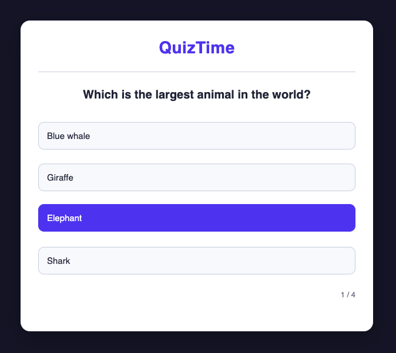

# Counter

A clean, Raycast-inspired counter with persistence and keyboard shortcuts.



## Features

- Increment / Decrement / Reset functionality
- Persistent storage using `localStorage` (survives page refresh)
- Full keyboard support (`↑` / `↓` arrows and `R` to reset)
- Modern glassmorphic UI inspired by Raycast
- Accessible (ARIA labels + live region)
- Clean modular architecture using ES Modules

## Live Demo

[Open Counter →](https://counter-lyart-eight.vercel.app/)

## Tech Stack

- Vanilla HTML5, CSS3, JavaScript (ES6+)
- No frameworks or libraries
- ES Modules for clean code organization

## What I Learned

- Deepened understanding of **closures** to maintain private state
- Proper use of **ES Modules** (`export default` + `import`)
- `localStorage` best practices (saving/loading, parsing safety)
- Keyboard event handling and accessibility basics
- Building polished UIs with pure CSS (glassmorphism, backdrop-filter)

This project was a great stepping stone from basic DOM manipulation to thinking in modules and private state — concepts that will be foundational for Lexicon and future React work.

## Architecture

The app uses the **Module Pattern** with a closure to keep `count` and DOM reference private:

```js
const Counter = (function () {
  let count = 0;
  // ...
  return { init, increment, decrement, reset };
})();
```
